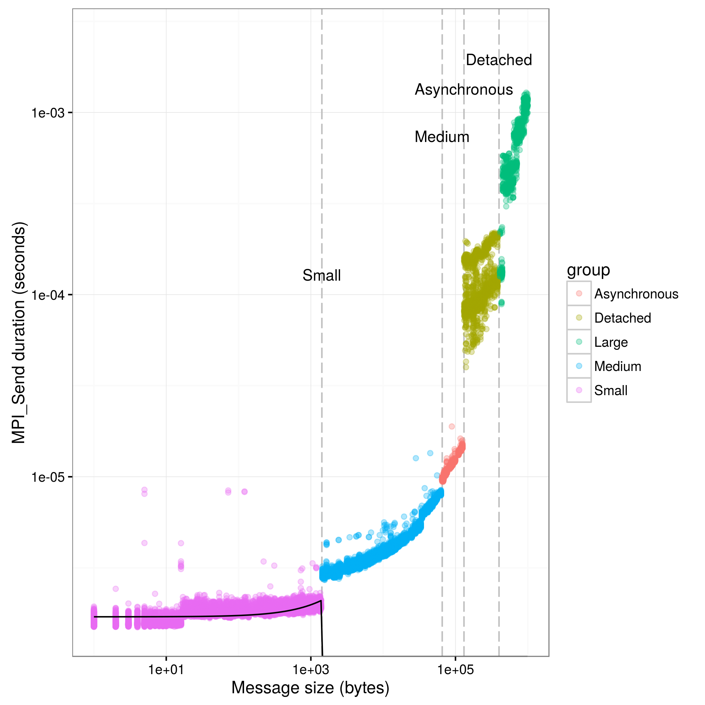
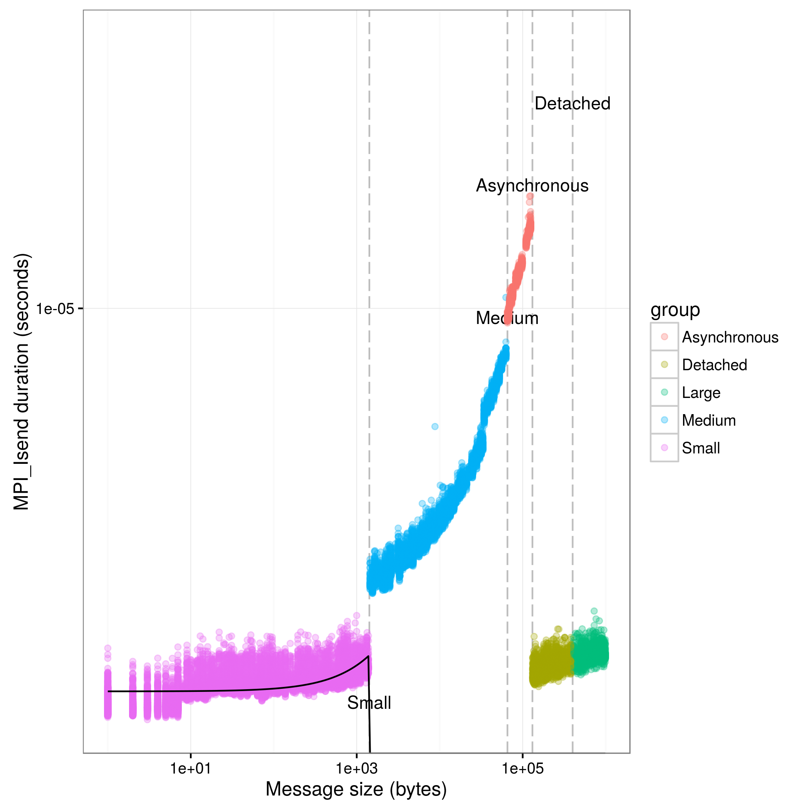
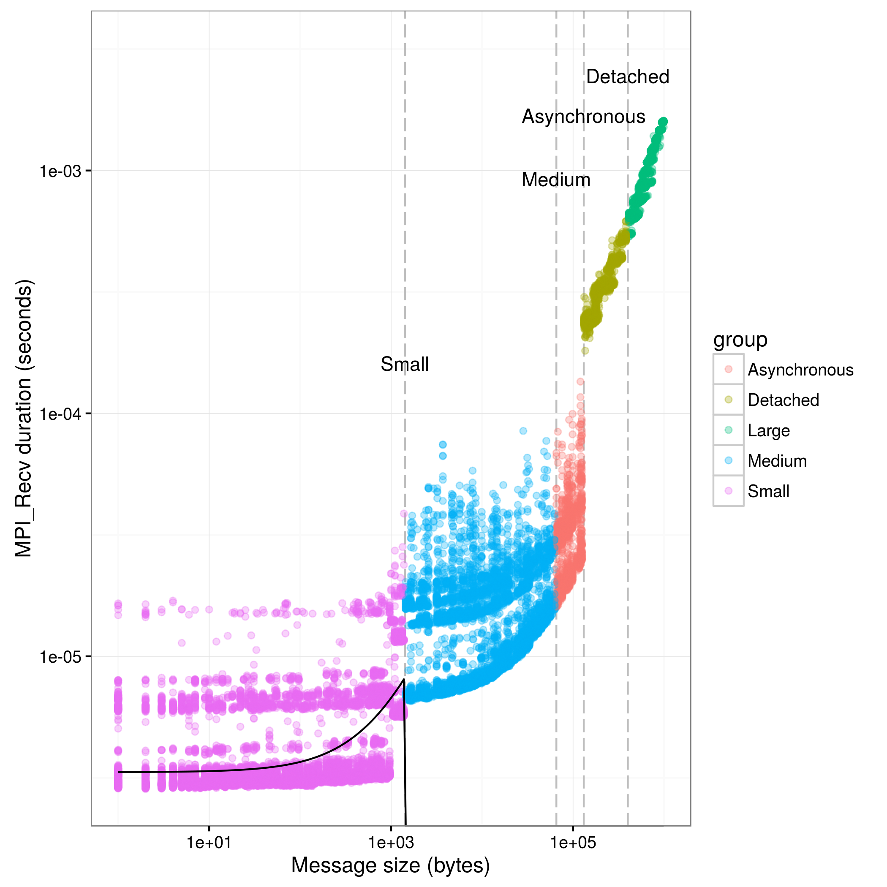
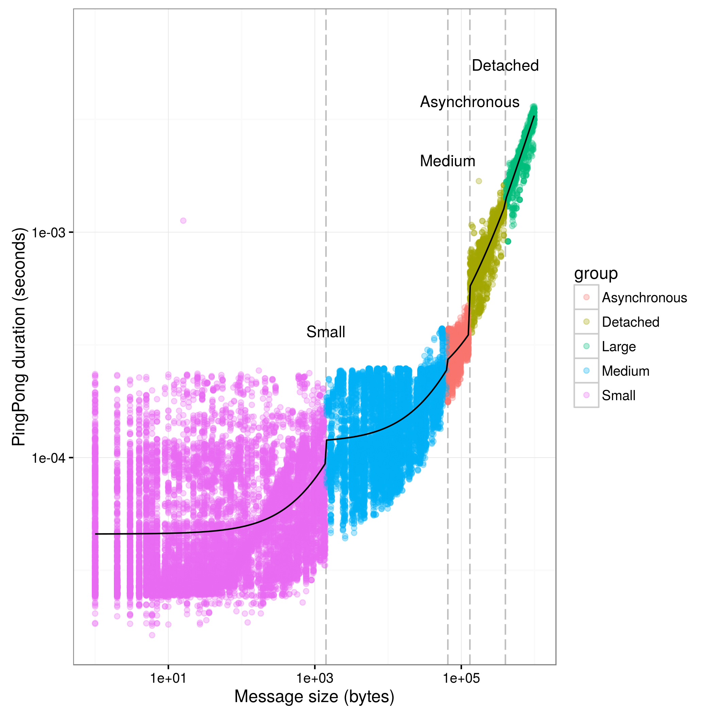
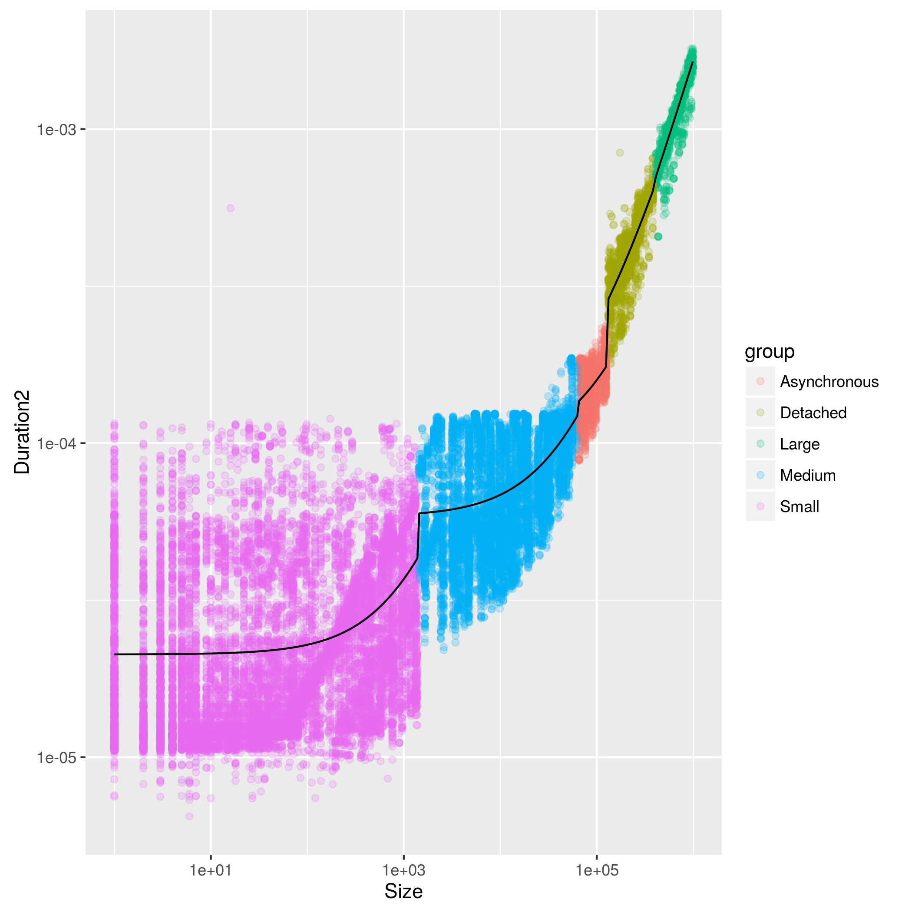
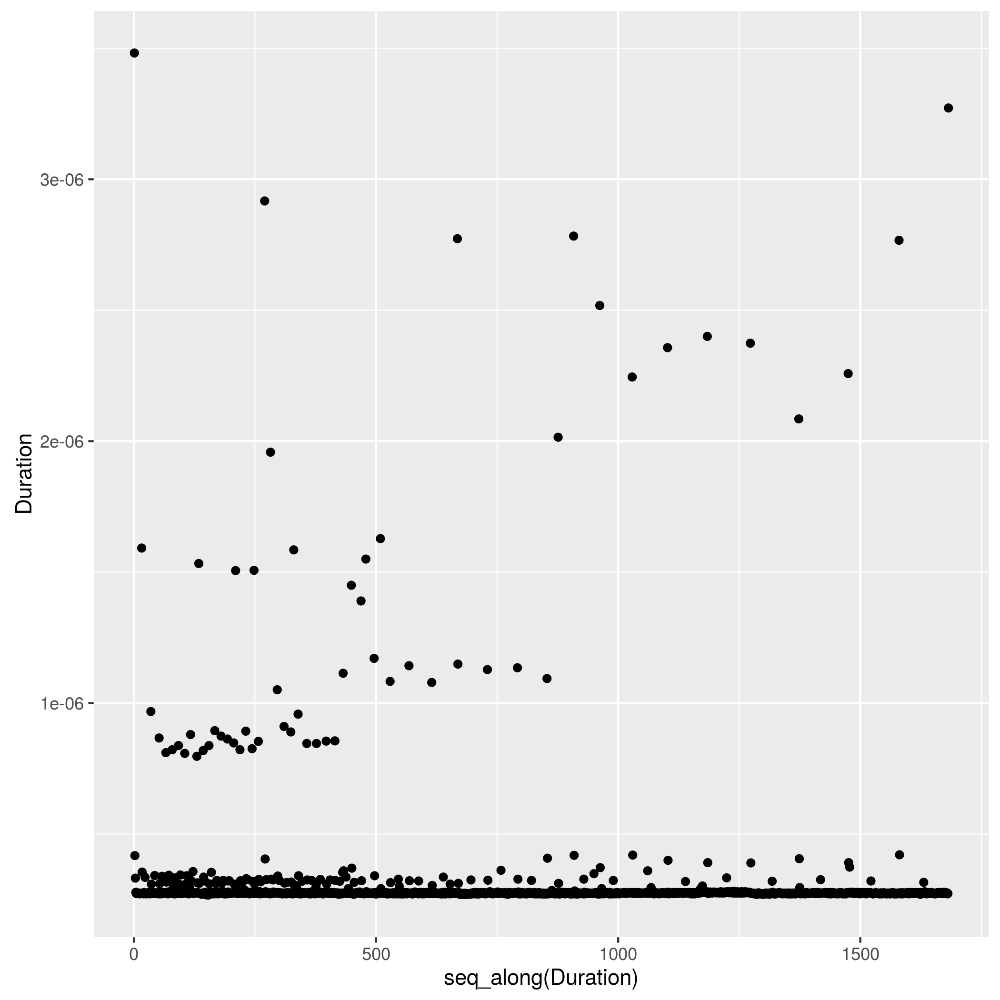
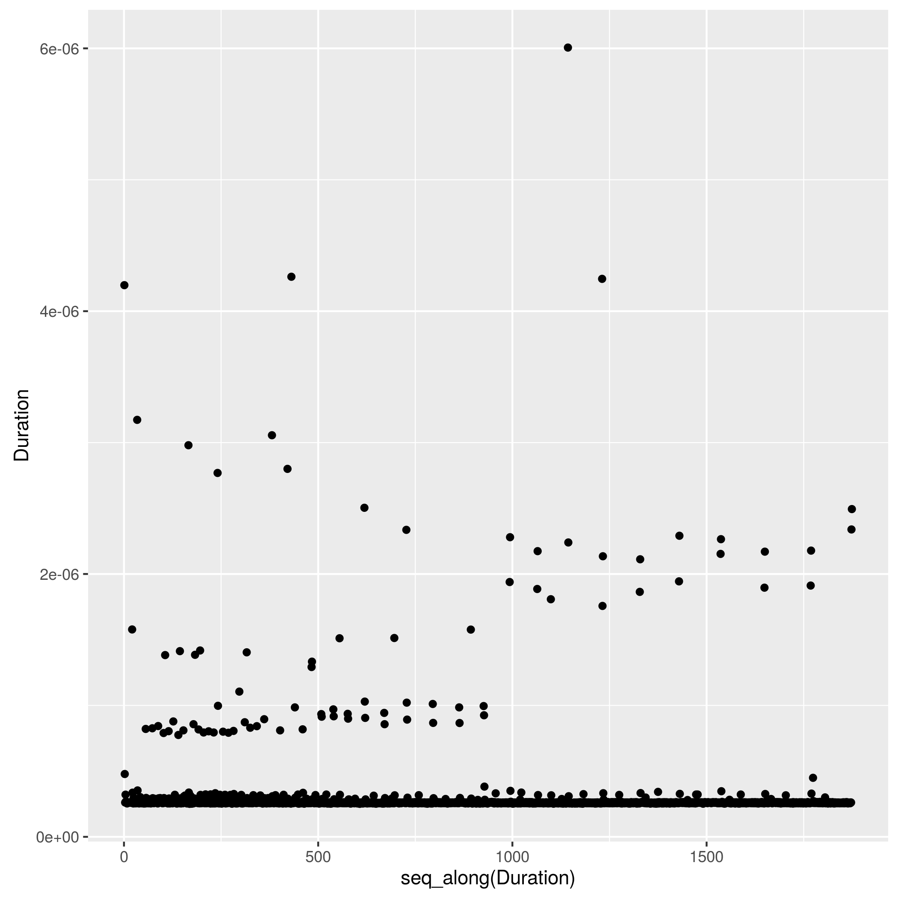

Analysis of Pont-to-point experiments of MPI calls
==================================================

```r
opts_chunk$set(cache=FALSE,dpi=300,echo=FALSE)
```


If needed, you should install the right packages (plyr, ggplot2, and
knitr) with the install.packages command.

```
## Loading required package: plyr
```

```
## Loading required package: ggplot2
```

```
## Loading required package: XML
```

```
## Loading required package: methods
```
Load XML config file and .csv resulting files from the MPI execution


MPI_Send timing
---------------

Timings for this experiment are taken from a ping-pong experiment, used to determine os.

We determine the piecewiese regression based on information taken from the regression file pointed in the XML configuration file


```
##        Limit         Name LimitInf
## 1       1420        Small        0
## 2      65536       Medium     1420
## 3     131072 Asynchronous    65536
## 4     400000     Detached   131072
## 5 2147483647        Large   400000
```
Display the regression factors to help tuning.

```
## [1] "----- Small-----"
## 
## Call:
## lm(formula = Duration ~ Size, data = d[d$group == bp[bp$Limit == 
##     lim, ]$Name, ])
## 
## Residuals:
##        Min         1Q     Median         3Q        Max 
## -2.620e-07 -1.218e-07  6.300e-09  6.960e-08  6.781e-06 
## 
## Coefficients:
##              Estimate Std. Error t value Pr(>|t|)    
## (Intercept) 1.703e-06  1.868e-09  911.96   <2e-16 ***
## Size        2.797e-10  4.697e-12   59.55   <2e-16 ***
## ---
## Signif. codes:  0 '***' 0.001 '**' 0.01 '*' 0.05 '.' 0.1 ' ' 1
## 
## Residual standard error: 1.891e-07 on 14591 degrees of freedom
## Multiple R-squared:  0.1955,	Adjusted R-squared:  0.1955 
## F-statistic:  3546 on 1 and 14591 DF,  p-value: < 2.2e-16
```
Visual representation of the computed data, to visualize correctness of the computed value.

The black line representing the regression should be very close to the values, and should drop to 0 when communications use the rendez-vous algorithm (Large messages, with a size > eager_threshold).

If they are not, tune the breakpoints in order to match more closely to your implementation. Thresholds for eager and detached messages depend on the library and the hardware used. Consult the documentation of your library on how to display this information if you can't visually determine it (For Ethernet network we saw values of 65536, while IB networks had values of 12288 or 17408 depending on the implementation)


```
## Saving 7 x 7 in image
```

```
## Warning: Removed 1 rows containing missing values (geom_vline).
```

```
## Warning: Removed 1 rows containing missing values (geom_text).
```

```
## Warning: Removed 1 rows containing missing values (geom_vline).
```

```
## Warning: Removed 1 rows containing missing values (geom_text).
```


MPI_Isend timing
---------------

As they may differ from Send times, check this and call it ois, to inject proper timings later.


Display the regression factors to help tuning

```
## [1] "----- Small-----"
## 
## Call:
## lm(formula = Duration ~ Size, data = d[d$group == bp[bp$Limit == 
##     lim, ]$Name, ])
## 
## Residuals:
##        Min         1Q     Median         3Q        Max 
## -2.166e-07 -8.085e-08 -1.010e-09  4.719e-08  5.368e-07 
## 
## Coefficients:
##              Estimate Std. Error t value Pr(>|t|)    
## (Intercept) 1.752e-06  1.044e-09    1678   <2e-16 ***
## Size        2.205e-10  2.625e-12      84   <2e-16 ***
## ---
## Signif. codes:  0 '***' 0.001 '**' 0.01 '*' 0.05 '.' 0.1 ' ' 1
## 
## Residual standard error: 1.057e-07 on 14596 degrees of freedom
## Multiple R-squared:  0.3259,	Adjusted R-squared:  0.3258 
## F-statistic:  7055 on 1 and 14596 DF,  p-value: < 2.2e-16
```
Visual representation of the computed data, to visualize correctness of the computed value

```
## Saving 7 x 7 in image
```

```
## Warning: Removed 1 rows containing missing values (geom_vline).
```

```
## Warning: Removed 1 rows containing missing values (geom_text).
```

```
## Warning: Removed 1 rows containing missing values (geom_vline).
```

```
## Warning: Removed 1 rows containing missing values (geom_text).
```



MPI_Recv timing
---------------

Timings are used to determine or. This experiment waits for a potentially eager message to arrive before launching the recv for small message size, eliminating waiting times as much as possible.


Display the regression factors to help tuning

```
## [1] "----- Small-----"
## 
## Call:
## lm(formula = Duration ~ Size, data = d[d$group == bp[bp$Limit == 
##     lim, ]$Name, ])
## 
## Residuals:
##        Min         1Q     Median         3Q        Max 
## -3.416e-06 -6.152e-07 -3.870e-07 -7.860e-08  3.064e-05 
## 
## Coefficients:
##              Estimate Std. Error t value Pr(>|t|)    
## (Intercept) 3.333e-06  1.950e-08  170.94   <2e-16 ***
## Size        3.409e-09  4.901e-11   69.55   <2e-16 ***
## ---
## Signif. codes:  0 '***' 0.001 '**' 0.01 '*' 0.05 '.' 0.1 ' ' 1
## 
## Residual standard error: 1.971e-06 on 14561 degrees of freedom
## Multiple R-squared:  0.2494,	Adjusted R-squared:  0.2493 
## F-statistic:  4837 on 1 and 14561 DF,  p-value: < 2.2e-16
```
Visual representation of the computed data, to visualize correctness of the computed value

```
## Saving 7 x 7 in image
```

```
## Warning: Removed 1 rows containing missing values (geom_vline).
```

```
## Warning: Removed 1 rows containing missing values (geom_text).
```

```
## Warning: Removed 1 rows containing missing values (geom_vline).
```

```
## Warning: Removed 1 rows containing missing values (geom_text).
```



Pingpong timing
---------------

pingpong = 2or+2transfer for small messages that are sent
  asynchronously.  For large sizes, communications are synchronous,
  hence we have pingpong = 2transfer.


```
## [1] "----- Small-----"
## 
## Call:
## lm(formula = Duration ~ Size, data = d[d$group == bp[bp$Limit == 
##     lim, ]$Name, ])
## 
## Residuals:
##        Min         1Q     Median         3Q        Max 
## -6.066e-05 -1.969e-05 -1.403e-05  9.880e-06  1.078e-03 
## 
## Coefficients:
##              Estimate Std. Error t value Pr(>|t|)    
## (Intercept) 4.582e-05  3.077e-07  148.89   <2e-16 ***
## Size        3.483e-08  7.734e-10   45.03   <2e-16 ***
## ---
## Signif. codes:  0 '***' 0.001 '**' 0.01 '*' 0.05 '.' 0.1 ' ' 1
## 
## Residual standard error: 3.473e-05 on 18148 degrees of freedom
## Multiple R-squared:  0.1005,	Adjusted R-squared:  0.1004 
## F-statistic:  2028 on 1 and 18148 DF,  p-value: < 2.2e-16
## 
## [1] "----- Medium-----"
## 
## Call:
## lm(formula = Duration ~ Size, data = d[d$group == bp[bp$Limit == 
##     lim, ]$Name, ])
## 
## Residuals:
##        Min         1Q     Median         3Q        Max 
## -8.841e-05 -3.930e-05 -1.280e-05  3.610e-05  1.463e-04 
## 
## Coefficients:
##              Estimate Std. Error t value Pr(>|t|)    
## (Intercept) 1.167e-04  8.090e-07  144.22   <2e-16 ***
## Size        2.034e-09  3.771e-11   53.92   <2e-16 ***
## ---
## Signif. codes:  0 '***' 0.001 '**' 0.01 '*' 0.05 '.' 0.1 ' ' 1
## 
## Residual standard error: 5.088e-05 on 8398 degrees of freedom
## Multiple R-squared:  0.2572,	Adjusted R-squared:  0.2571 
## F-statistic:  2908 on 1 and 8398 DF,  p-value: < 2.2e-16
## 
## [1] "----- Asynchronous-----"
## 
## Call:
## lm(formula = Duration ~ Size, data = d[d$group == bp[bp$Limit == 
##     lim, ]$Name, ])
## 
## Residuals:
##        Min         1Q     Median         3Q        Max 
## -1.022e-04 -4.049e-05 -3.266e-06  3.740e-05  1.307e-04 
## 
## Coefficients:
##              Estimate Std. Error t value Pr(>|t|)    
## (Intercept) 1.868e-04  5.936e-06   31.47   <2e-16 ***
## Size        1.311e-09  6.405e-11   20.46   <2e-16 ***
## ---
## Signif. codes:  0 '***' 0.001 '**' 0.01 '*' 0.05 '.' 0.1 ' ' 1
## 
## Residual standard error: 4.773e-05 on 1648 degrees of freedom
## Multiple R-squared:  0.2026,	Adjusted R-squared:  0.2021 
## F-statistic: 418.7 on 1 and 1648 DF,  p-value: < 2.2e-16
## 
## [1] "----- Detached-----"
## 
## Call:
## lm(formula = Duration ~ Size, data = d[d$group == bp[bp$Limit == 
##     lim, ]$Name, ])
## 
## Residuals:
##        Min         1Q     Median         3Q        Max 
## -4.012e-04 -6.095e-05  1.120e-06  6.768e-05  9.917e-04 
## 
## Coefficients:
##              Estimate Std. Error t value Pr(>|t|)    
## (Intercept) 2.080e-04  7.174e-06   28.99   <2e-16 ***
## Size        2.788e-09  3.245e-11   85.93   <2e-16 ***
## ---
## Signif. codes:  0 '***' 0.001 '**' 0.01 '*' 0.05 '.' 0.1 ' ' 1
## 
## Residual standard error: 0.0001093 on 2748 degrees of freedom
## Multiple R-squared:  0.7288,	Adjusted R-squared:  0.7287 
## F-statistic:  7383 on 1 and 2748 DF,  p-value: < 2.2e-16
## 
## [1] "----- Large-----"
## 
## Call:
## lm(formula = Duration ~ Size, data = d[d$group == bp[bp$Limit == 
##     lim, ]$Name, ])
## 
## Residuals:
##        Min         1Q     Median         3Q        Max 
## -9.093e-04 -5.522e-05  2.426e-05  9.963e-05  4.653e-04 
## 
## Coefficients:
##              Estimate Std. Error t value Pr(>|t|)    
## (Intercept) 9.238e-05  1.678e-05   5.506 4.12e-08 ***
## Size        3.228e-09  2.421e-11 133.331  < 2e-16 ***
## ---
## Signif. codes:  0 '***' 0.001 '**' 0.01 '*' 0.05 '.' 0.1 ' ' 1
## 
## Residual standard error: 0.0001806 on 2148 degrees of freedom
## Multiple R-squared:  0.8922,	Adjusted R-squared:  0.8921 
## F-statistic: 1.778e+04 on 1 and 2148 DF,  p-value: < 2.2e-16
```

```
## Saving 7 x 7 in image
```

```
## Warning: Removed 1 rows containing missing values (geom_vline).
```

```
## Warning: Removed 1 rows containing missing values (geom_text).
```

```
## Warning: Removed 1 rows containing missing values (geom_vline).
```

```
## Warning: Removed 1 rows containing missing values (geom_text).
```



Print results in Simgrid's xml format

  
MPI_Wtime timing
---------------

We made a run with 10 millions calls to MPI\_Wtime and we want to know the time of one call


Time for one MPI_Wtime call

```
## [1] 4.085767e-08
```
MPI_Iprobe timing
----------------
We made 1000 runs of pingpong with pollling on MPI\_Iprobe. Compute the Duration of such a call, and check whether its time is related to the size of the message


Time for one MPI_Iprobe call

```
## [1] 2.751813e-07
```

MPI_Test timing
---------------


Time for one MPI_Test call

```
## [1] 2.601073e-07
```


Result of calibration.
---------------

The following snippet of XML has to be included at the beginning of your platformfile. Please report to the SimGrid mailing list any bug with the calibration or the generated platform file.


```
## <config id="General">
##  <prop id="smpi/os" value="0:1.70323849188712e-06:2.79726695925964e-10;1420:0:0;65536:0:0;131072:0:0;4e+05:0:0"/>
##  <prop id="smpi/ois" value="0:1.75232188013067e-06:2.20494312485917e-10;1420:0:0;65536:0:0;131072:0:0;4e+05:0:0"/>
##  <prop id="smpi/or" value="0:3.33315583120708e-06:3.40864964492857e-09;1420:0:0;65536:0:0;131072:0:0;4e+05:0:0"/>
##  <prop id="smpi/bw-factor" value="0:0.0636575813349588;1420:0.983495291166692;65536:1.52596144919948;131072:0.717251283995903;4e+05:0.619663249676955"/>
##  <prop id="smpi/lat-factor" value="0:0.424821296069165;1420:1.16678508115501;65536:1.86811479079315;131072:2.0798208704917;4e+05:0.923798288770192"/>
##  <prop id="smpi/async-small-thres" value="17408"/>
##  <prop id="smpi/send-is-detached-thres" value="17408"/>
##  <prop id="smpi/wtime" value="4.085767e-08"/>
##  <prop id="smpi/iprobe" value="2.75181277860327e-07"/>
##  <prop id="smpi/test" value="2.60107333333333e-07"/>
## </config>
```

```
## [1] "Results written in testplatform.xml"
```

```
## [1] "testplatform_output.xml"
```

