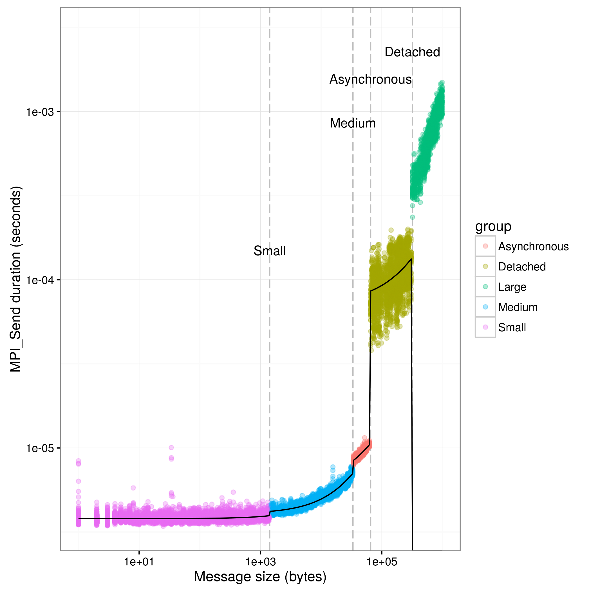
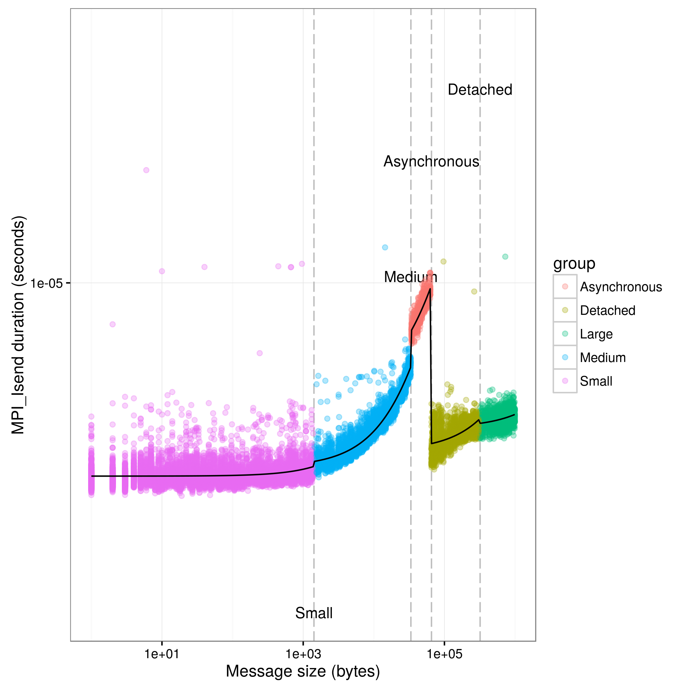
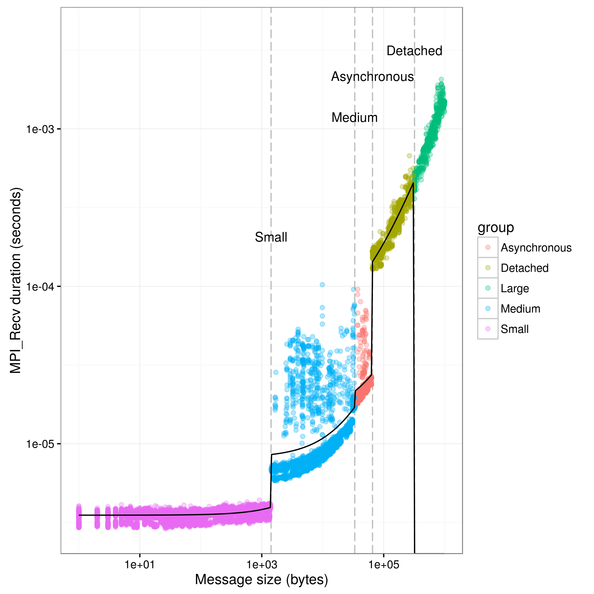
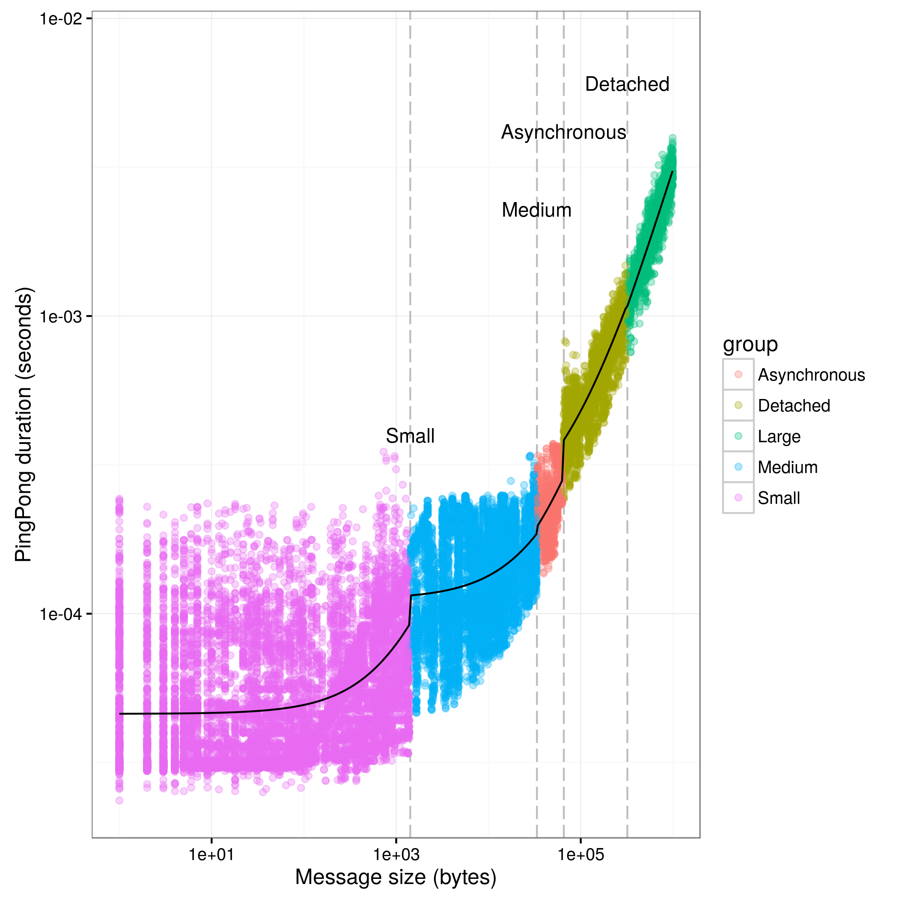
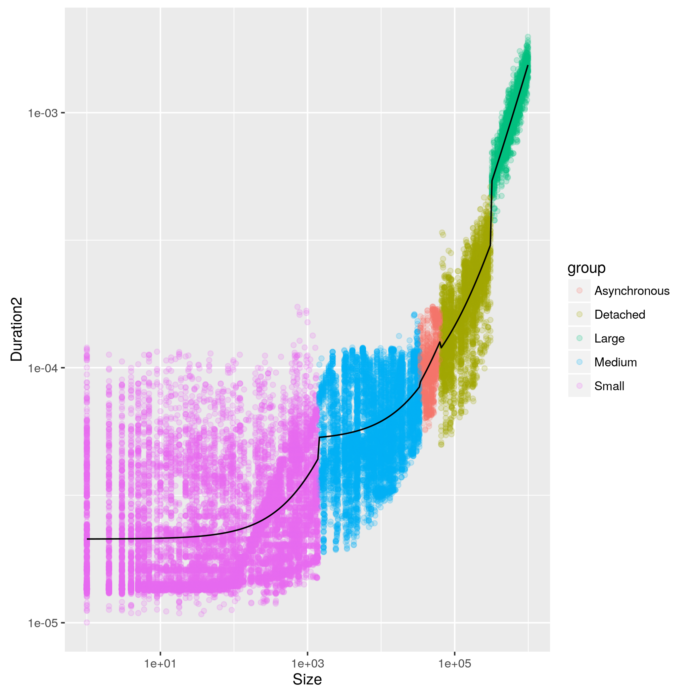
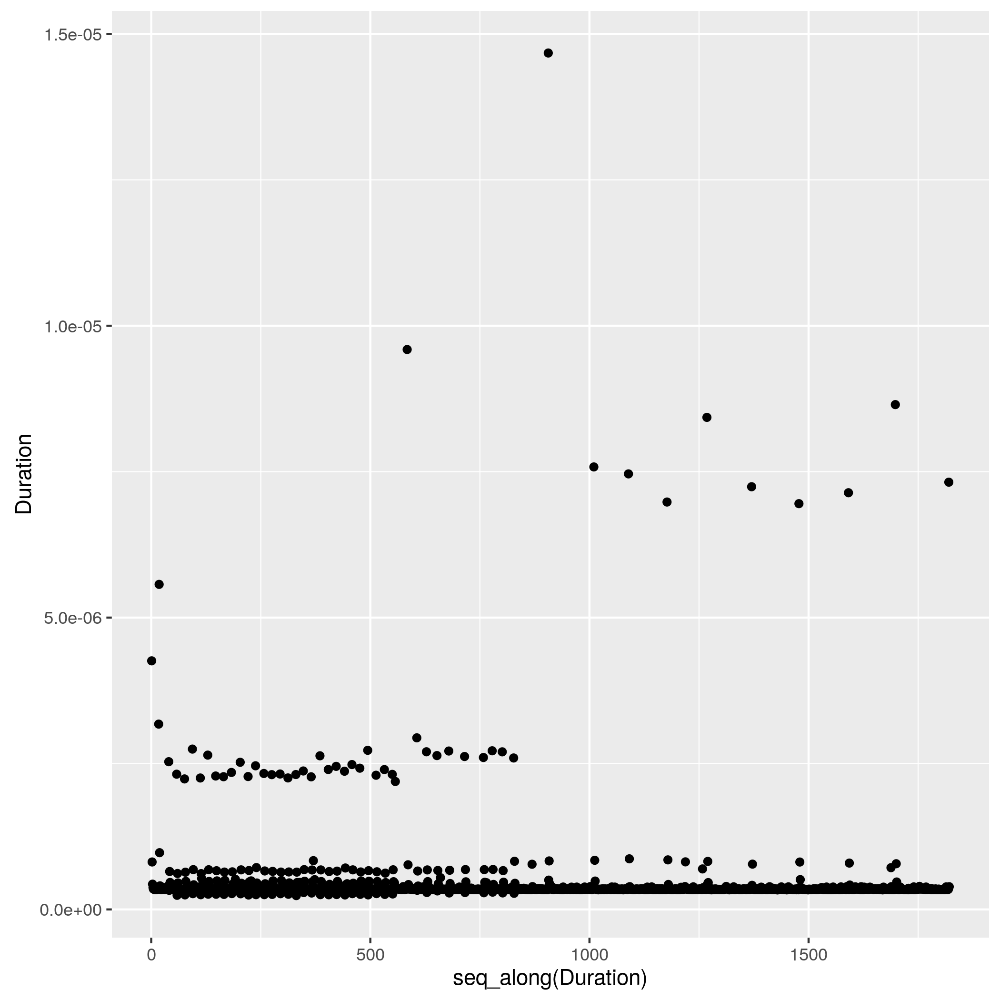
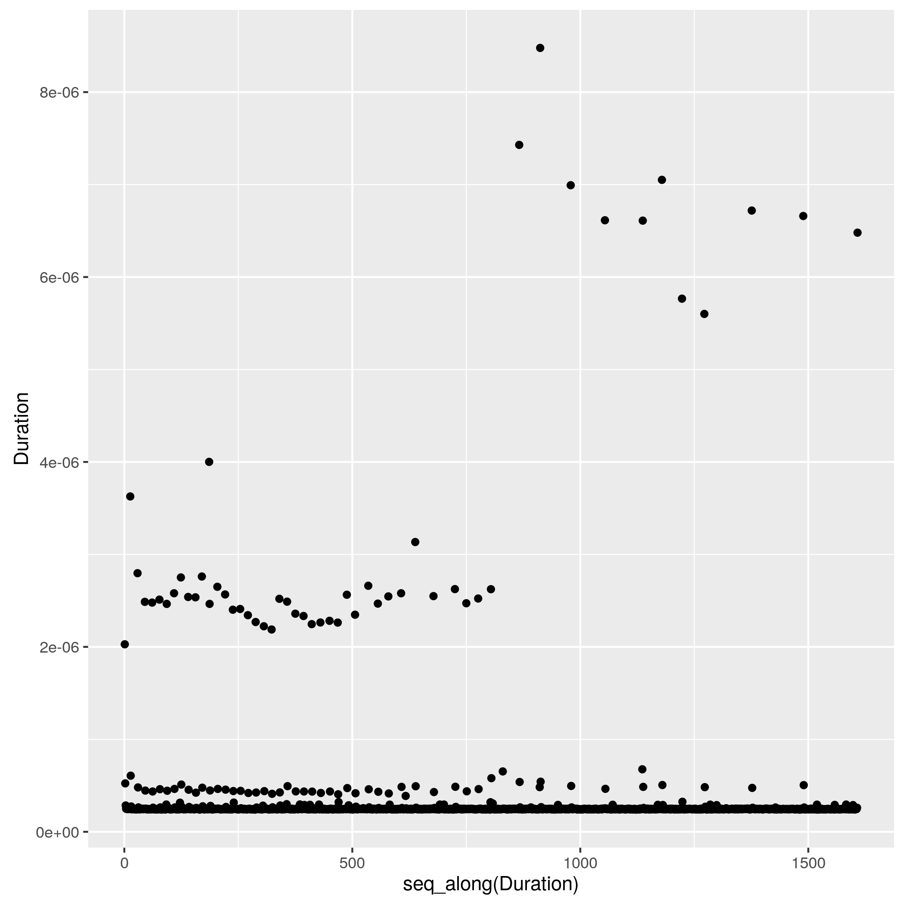

Analysis of Pont-to-point experiments of MPI calls
==================================================

```r
opts_chunk$set(cache=FALSE,dpi=300,echo=FALSE)
```


If needed, you should install the right packages (plyr, ggplot2, and
knitr) with the install.packages command.

```
## Loading required package: plyr
```

```
## Loading required package: ggplot2
```

```
## Loading required package: XML
```

```
## Loading required package: methods
```
Load XML config file and .csv resulting files from the MPI execution


MPI_Send timing
---------------

Timings for this experiment are taken from a ping-pong experiment, used to determine os.

We determine the piecewiese regression based on information taken from the regression file pointed in the XML configuration file


```
##        Limit         Name LimitInf
## 1       1420        Small        0
## 2      33500       Medium     1420
## 3      65536 Asynchronous    33500
## 4     320000     Detached    65536
## 5 2147483647        Large   320000
```
Display the regression factors to help tuning.

```
## [1] "----- Small-----"
## 
## Call:
## lm(formula = Duration ~ Size, data = d[d$group == bp[bp$Limit == 
##     lim, ]$Name, ])
## 
## Residuals:
##        Min         1Q     Median         3Q        Max 
## -3.802e-07 -9.420e-08 -2.280e-08  5.920e-08  6.244e-06 
## 
## Coefficients:
##              Estimate Std. Error t value Pr(>|t|)    
## (Intercept) 3.799e-06  1.766e-09 2151.73   <2e-16 ***
## Size        1.098e-10  4.436e-12   24.75   <2e-16 ***
## ---
## Signif. codes:  0 '***' 0.001 '**' 0.01 '*' 0.05 '.' 0.1 ' ' 1
## 
## Residual standard error: 1.783e-07 on 14521 degrees of freedom
## Multiple R-squared:  0.04049,	Adjusted R-squared:  0.04042 
## F-statistic: 612.7 on 1 and 14521 DF,  p-value: < 2.2e-16
## 
## [1] "----- Medium-----"
## 
## Call:
## lm(formula = Duration ~ Size, data = d[d$group == bp[bp$Limit == 
##     lim, ]$Name, ])
## 
## Residuals:
##        Min         1Q     Median         3Q        Max 
## -6.392e-07 -1.233e-07 -1.981e-08  1.050e-07  2.235e-06 
## 
## Coefficients:
##              Estimate Std. Error t value Pr(>|t|)    
## (Intercept) 4.068e-06  4.111e-09   989.5   <2e-16 ***
## Size        8.988e-11  2.902e-13   309.7   <2e-16 ***
## ---
## Signif. codes:  0 '***' 0.001 '**' 0.01 '*' 0.05 '.' 0.1 ' ' 1
## 
## Residual standard error: 1.956e-07 on 5881 degrees of freedom
## Multiple R-squared:  0.9422,	Adjusted R-squared:  0.9422 
## F-statistic: 9.591e+04 on 1 and 5881 DF,  p-value: < 2.2e-16
## 
## [1] "----- Asynchronous-----"
## 
## Call:
## lm(formula = Duration ~ Size, data = d[d$group == bp[bp$Limit == 
##     lim, ]$Name, ])
## 
## Residuals:
##        Min         1Q     Median         3Q        Max 
## -5.556e-07 -1.998e-07 -3.463e-08  1.511e-07  1.795e-06 
## 
## Coefficients:
##              Estimate Std. Error t value Pr(>|t|)    
## (Intercept) 6.012e-06  5.759e-08  104.39   <2e-16 ***
## Size        7.101e-11  1.207e-12   58.84   <2e-16 ***
## ---
## Signif. codes:  0 '***' 0.001 '**' 0.01 '*' 0.05 '.' 0.1 ' ' 1
## 
## Residual standard error: 2.765e-07 on 838 degrees of freedom
## Multiple R-squared:  0.8051,	Adjusted R-squared:  0.8049 
## F-statistic:  3462 on 1 and 838 DF,  p-value: < 2.2e-16
## 
## [1] "----- Detached-----"
## 
## Call:
## lm(formula = Duration ~ Size, data = d[d$group == bp[bp$Limit == 
##     lim, ]$Name, ])
## 
## Residuals:
##        Min         1Q     Median         3Q        Max 
## -6.298e-05 -2.002e-05 -3.472e-06  1.629e-05  9.634e-05 
## 
## Coefficients:
##              Estimate Std. Error t value Pr(>|t|)    
## (Intercept) 7.283e-05  1.197e-06   60.84   <2e-16 ***
## Size        1.968e-10  7.127e-12   27.62   <2e-16 ***
## ---
## Signif. codes:  0 '***' 0.001 '**' 0.01 '*' 0.05 '.' 0.1 ' ' 1
## 
## Residual standard error: 2.662e-05 on 3318 degrees of freedom
## Multiple R-squared:  0.1869,	Adjusted R-squared:  0.1867 
## F-statistic: 762.8 on 1 and 3318 DF,  p-value: < 2.2e-16
```
Visual representation of the computed data, to visualize correctness of the computed value.

The black line representing the regression should be very close to the values, and should drop to 0 when communications use the rendez-vous algorithm (Large messages, with a size > eager_threshold).

If they are not, tune the breakpoints in order to match more closely to your implementation. Thresholds for eager and detached messages depend on the library and the hardware used. Consult the documentation of your library on how to display this information if you can't visually determine it (For Ethernet network we saw values of 65536, while IB networks had values of 12288 or 17408 depending on the implementation)


```
## Saving 7 x 7 in image
```

```
## Warning: Removed 1 rows containing missing values (geom_vline).
```

```
## Warning: Removed 1 rows containing missing values (geom_text).
```

```
## Warning: Removed 1 rows containing missing values (geom_vline).
```

```
## Warning: Removed 1 rows containing missing values (geom_text).
```


MPI_Isend timing
---------------

As they may differ from Send times, check this and call it ois, to inject proper timings later.


Display the regression factors to help tuning

```
## [1] "----- Small-----"
## 
## Call:
## lm(formula = Duration ~ Size, data = d[d$group == bp[bp$Limit == 
##     lim, ]$Name, ])
## 
## Residuals:
##        Min         1Q     Median         3Q        Max 
## -3.600e-07 -1.040e-07 -4.010e-08  4.480e-08  1.432e-05 
## 
## Coefficients:
##              Estimate Std. Error t value Pr(>|t|)    
## (Intercept) 3.658e-06  2.645e-09 1383.27   <2e-16 ***
## Size        1.333e-10  6.648e-12   20.05   <2e-16 ***
## ---
## Signif. codes:  0 '***' 0.001 '**' 0.01 '*' 0.05 '.' 0.1 ' ' 1
## 
## Residual standard error: 2.671e-07 on 14537 degrees of freedom
## Multiple R-squared:  0.0269,	Adjusted R-squared:  0.02684 
## F-statistic: 401.9 on 1 and 14537 DF,  p-value: < 2.2e-16
## 
## [1] "----- Medium-----"
## 
## Call:
## lm(formula = Duration ~ Size, data = d[d$group == bp[bp$Limit == 
##     lim, ]$Name, ])
## 
## Residuals:
##        Min         1Q     Median         3Q        Max 
## -5.028e-07 -1.222e-07 -3.390e-08  8.100e-08  7.059e-06 
## 
## Coefficients:
##              Estimate Std. Error t value Pr(>|t|)    
## (Intercept) 3.837e-06  4.681e-09   819.7   <2e-16 ***
## Size        7.849e-11  3.305e-13   237.5   <2e-16 ***
## ---
## Signif. codes:  0 '***' 0.001 '**' 0.01 '*' 0.05 '.' 0.1 ' ' 1
## 
## Residual standard error: 2.228e-07 on 5884 degrees of freedom
## Multiple R-squared:  0.9055,	Adjusted R-squared:  0.9055 
## F-statistic: 5.638e+04 on 1 and 5884 DF,  p-value: < 2.2e-16
## 
## [1] "----- Asynchronous-----"
## 
## Call:
## lm(formula = Duration ~ Size, data = d[d$group == bp[bp$Limit == 
##     lim, ]$Name, ])
## 
## Residuals:
##        Min         1Q     Median         3Q        Max 
## -7.843e-07 -2.091e-07 -5.625e-08  1.722e-07  1.161e-06 
## 
## Coefficients:
##              Estimate Std. Error t value Pr(>|t|)    
## (Intercept) 5.572e-06  6.352e-08   87.72   <2e-16 ***
## Size        6.567e-11  1.331e-12   49.33   <2e-16 ***
## ---
## Signif. codes:  0 '***' 0.001 '**' 0.01 '*' 0.05 '.' 0.1 ' ' 1
## 
## Residual standard error: 3.05e-07 on 838 degrees of freedom
## Multiple R-squared:  0.7438,	Adjusted R-squared:  0.7435 
## F-statistic:  2433 on 1 and 838 DF,  p-value: < 2.2e-16
## 
## [1] "----- Detached-----"
## 
## Call:
## lm(formula = Duration ~ Size, data = d[d$group == bp[bp$Limit == 
##     lim, ]$Name, ])
## 
## Residuals:
##        Min         1Q     Median         3Q        Max 
## -5.608e-07 -1.319e-07 -1.900e-08  9.350e-08  6.768e-06 
## 
## Coefficients:
##              Estimate Std. Error t value Pr(>|t|)    
## (Intercept) 4.178e-06  1.138e-08  367.14   <2e-16 ***
## Size        2.375e-12  6.775e-14   35.05   <2e-16 ***
## ---
## Signif. codes:  0 '***' 0.001 '**' 0.01 '*' 0.05 '.' 0.1 ' ' 1
## 
## Residual standard error: 2.53e-07 on 3319 degrees of freedom
## Multiple R-squared:  0.2702,	Adjusted R-squared:  0.2699 
## F-statistic:  1229 on 1 and 3319 DF,  p-value: < 2.2e-16
```
Visual representation of the computed data, to visualize correctness of the computed value

```
## Saving 7 x 7 in image
```

```
## Warning: Removed 1 rows containing missing values (geom_vline).
```

```
## Warning: Removed 1 rows containing missing values (geom_text).
```

```
## Warning: Removed 1 rows containing missing values (geom_vline).
```

```
## Warning: Removed 1 rows containing missing values (geom_text).
```



MPI_Recv timing
---------------

Timings are used to determine or. This experiment waits for a potentially eager message to arrive before launching the recv for small message size, eliminating waiting times as much as possible.


Display the regression factors to help tuning

```
## [1] "----- Small-----"
## 
## Call:
## lm(formula = Duration ~ Size, data = d[d$group == bp[bp$Limit == 
##     lim, ]$Name, ])
## 
## Residuals:
##        Min         1Q     Median         3Q        Max 
## -6.544e-07 -4.154e-08  3.291e-08  1.053e-07  5.930e-07 
## 
## Coefficients:
##              Estimate Std. Error t value Pr(>|t|)    
## (Intercept) 3.518e-06  1.812e-09 1941.09   <2e-16 ***
## Size        3.018e-10  4.558e-12   66.22   <2e-16 ***
## ---
## Signif. codes:  0 '***' 0.001 '**' 0.01 '*' 0.05 '.' 0.1 ' ' 1
## 
## Residual standard error: 1.832e-07 on 14549 degrees of freedom
## Multiple R-squared:  0.2316,	Adjusted R-squared:  0.2315 
## F-statistic:  4385 on 1 and 14549 DF,  p-value: < 2.2e-16
## 
## [1] "----- Medium-----"
## 
## Call:
## lm(formula = Duration ~ Size, data = d[d$group == bp[bp$Limit == 
##     lim, ]$Name, ])
## 
## Residuals:
##        Min         1Q     Median         3Q        Max 
## -3.796e-06 -2.011e-06 -1.799e-06 -1.630e-06  9.171e-05 
## 
## Coefficients:
##              Estimate Std. Error t value Pr(>|t|)    
## (Intercept) 8.161e-06  1.405e-07   58.08   <2e-16 ***
## Size        2.668e-10  9.921e-12   26.89   <2e-16 ***
## ---
## Signif. codes:  0 '***' 0.001 '**' 0.01 '*' 0.05 '.' 0.1 ' ' 1
## 
## Residual standard error: 6.687e-06 on 5883 degrees of freedom
## Multiple R-squared:  0.1095,	Adjusted R-squared:  0.1093 
## F-statistic: 723.4 on 1 and 5883 DF,  p-value: < 2.2e-16
## 
## [1] "----- Asynchronous-----"
## 
## Call:
## lm(formula = Duration ~ Size, data = d[d$group == bp[bp$Limit == 
##     lim, ]$Name, ])
## 
## Residuals:
##        Min         1Q     Median         3Q        Max 
## -4.619e-06 -3.055e-06 -1.584e-06 -1.060e-06  7.341e-05 
## 
## Coefficients:
##              Estimate Std. Error t value Pr(>|t|)    
## (Intercept) 1.493e-05  1.701e-06   8.782  < 2e-16 ***
## Size        1.977e-10  3.564e-11   5.546 3.91e-08 ***
## ---
## Signif. codes:  0 '***' 0.001 '**' 0.01 '*' 0.05 '.' 0.1 ' ' 1
## 
## Residual standard error: 8.165e-06 on 839 degrees of freedom
## Multiple R-squared:  0.03537,	Adjusted R-squared:  0.03422 
## F-statistic: 30.76 on 1 and 839 DF,  p-value: 3.91e-08
```
Visual representation of the computed data, to visualize correctness of the computed value

```
## Saving 7 x 7 in image
```

```
## Warning: Removed 1 rows containing missing values (geom_vline).
```

```
## Warning: Removed 1 rows containing missing values (geom_text).
```

```
## Warning: Removed 1 rows containing missing values (geom_vline).
```

```
## Warning: Removed 1 rows containing missing values (geom_text).
```



Pingpong timing
---------------

pingpong = 2or+2transfer for small messages that are sent
  asynchronously.  For large sizes, communications are synchronous,
  hence we have pingpong = 2transfer.


```
## [1] "----- Small-----"
## 
## Call:
## lm(formula = Duration ~ Size, data = d[d$group == bp[bp$Limit == 
##     lim, ]$Name, ])
## 
## Residuals:
##        Min         1Q     Median         3Q        Max 
## -5.670e-05 -1.584e-05 -1.430e-05  6.324e-06  2.801e-04 
## 
## Coefficients:
##              Estimate Std. Error t value Pr(>|t|)    
## (Intercept) 4.609e-05  2.726e-07  169.05   <2e-16 ***
## Size        3.297e-08  6.852e-10   48.11   <2e-16 ***
## ---
## Signif. codes:  0 '***' 0.001 '**' 0.01 '*' 0.05 '.' 0.1 ' ' 1
## 
## Residual standard error: 3.077e-05 on 18148 degrees of freedom
## Multiple R-squared:  0.1131,	Adjusted R-squared:  0.1131 
## F-statistic:  2314 on 1 and 18148 DF,  p-value: < 2.2e-16
## 
## [1] "----- Medium-----"
## 
## Call:
## lm(formula = Duration ~ Size, data = d[d$group == bp[bp$Limit == 
##     lim, ]$Name, ])
## 
## Residuals:
##        Min         1Q     Median         3Q        Max 
## -7.178e-05 -3.503e-05 -1.338e-05  3.347e-05  1.651e-04 
## 
## Coefficients:
##              Estimate Std. Error t value Pr(>|t|)    
## (Intercept) 1.120e-04  8.690e-07  128.93   <2e-16 ***
## Size        2.208e-09  6.134e-11   35.99   <2e-16 ***
## ---
## Signif. codes:  0 '***' 0.001 '**' 0.01 '*' 0.05 '.' 0.1 ' ' 1
## 
## Residual standard error: 4.621e-05 on 7348 degrees of freedom
## Multiple R-squared:  0.1499,	Adjusted R-squared:  0.1498 
## F-statistic:  1295 on 1 and 7348 DF,  p-value: < 2.2e-16
## 
## [1] "----- Asynchronous-----"
## 
## Call:
## lm(formula = Duration ~ Size, data = d[d$group == bp[bp$Limit == 
##     lim, ]$Name, ])
## 
## Residuals:
##        Min         1Q     Median         3Q        Max 
## -9.103e-05 -3.591e-05 -7.514e-06  2.952e-05  1.418e-04 
## 
## Coefficients:
##              Estimate Std. Error t value Pr(>|t|)    
## (Intercept) 9.985e-05  9.078e-06   11.00   <2e-16 ***
## Size        2.863e-09  1.903e-10   15.05   <2e-16 ***
## ---
## Signif. codes:  0 '***' 0.001 '**' 0.01 '*' 0.05 '.' 0.1 ' ' 1
## 
## Residual standard error: 4.873e-05 on 1048 degrees of freedom
## Multiple R-squared:  0.1777,	Adjusted R-squared:  0.1769 
## F-statistic: 226.5 on 1 and 1048 DF,  p-value: < 2.2e-16
## 
## [1] "----- Detached-----"
## 
## Call:
## lm(formula = Duration ~ Size, data = d[d$group == bp[bp$Limit == 
##     lim, ]$Name, ])
## 
## Residuals:
##        Min         1Q     Median         3Q        Max 
## -3.489e-04 -5.600e-05 -4.300e-06  5.789e-05  4.354e-04 
## 
## Coefficients:
##              Estimate Std. Error t value Pr(>|t|)    
## (Intercept) 1.986e-04  3.855e-06   51.53   <2e-16 ***
## Size        2.813e-09  2.295e-11  122.58   <2e-16 ***
## ---
## Signif. codes:  0 '***' 0.001 '**' 0.01 '*' 0.05 '.' 0.1 ' ' 1
## 
## Residual standard error: 9.582e-05 on 4148 degrees of freedom
## Multiple R-squared:  0.7837,	Adjusted R-squared:  0.7836 
## F-statistic: 1.503e+04 on 1 and 4148 DF,  p-value: < 2.2e-16
## 
## [1] "----- Large-----"
## 
## Call:
## lm(formula = Duration ~ Size, data = d[d$group == bp[bp$Limit == 
##     lim, ]$Name, ])
## 
## Residuals:
##        Min         1Q     Median         3Q        Max 
## -7.476e-04 -1.461e-04 -2.049e-05  1.476e-04  1.078e-03 
## 
## Coefficients:
##              Estimate Std. Error t value Pr(>|t|)    
## (Intercept) 1.247e-04  1.745e-05   7.146 1.18e-12 ***
## Size        2.981e-09  2.621e-11 113.747  < 2e-16 ***
## ---
## Signif. codes:  0 '***' 0.001 '**' 0.01 '*' 0.05 '.' 0.1 ' ' 1
## 
## Residual standard error: 0.0002325 on 2398 degrees of freedom
## Multiple R-squared:  0.8436,	Adjusted R-squared:  0.8436 
## F-statistic: 1.294e+04 on 1 and 2398 DF,  p-value: < 2.2e-16
```

```
## Saving 7 x 7 in image
```

```
## Warning: Removed 1 rows containing missing values (geom_vline).
```

```
## Warning: Removed 1 rows containing missing values (geom_text).
```

```
## Warning: Removed 1 rows containing missing values (geom_vline).
```

```
## Warning: Removed 1 rows containing missing values (geom_text).
```



Print results in Simgrid's xml format

  
MPI_Wtime timing
---------------

We made a run with 10 millions calls to MPI\_Wtime and we want to know the time of one call


Time for one MPI_Wtime call

```
## [1] 4.195637e-08
```
MPI_Iprobe timing
----------------
We made 1000 runs of pingpong with pollling on MPI\_Iprobe. Compute the Duration of such a call, and check whether its time is related to the size of the message


Time for one MPI_Iprobe call

```
## [1] 3.494798e-07
```

MPI_Test timing
---------------


Time for one MPI_Test call

```
## [1] 2.463276e-07
```


Result of calibration.
---------------

The following snippet of XML has to be included at the beginning of your platformfile. Please report to the SimGrid mailing list any bug with the calibration or the generated platform file.


```
## <config id="General">
##  <prop id="smpi/os" value="0:3.79946267082783e-06:1.09809596167633e-10;1420:4.06752467953734e-06:8.98782555257323e-11;33500:6.01204627458251e-06:7.10122202865045e-11;65536:7.28270630967833e-05:1.9683266729216e-10;320000:0:0"/>
##  <prop id="smpi/ois" value="0:3.65848336553355e-06:1.33280621516301e-10;1420:3.83673729379869e-06:7.84867337035856e-11;33500:5.57232433176236e-06:6.5668893954931e-11;65536:4.17803219267394e-06:2.37460347640595e-12;320000:4.70677307448713e-06:3.38065421824938e-13"/>
##  <prop id="smpi/or" value="0:3.51809764924934e-06:3.01847204118237e-10;1420:8.16124874852713e-06:2.66840481979518e-10;33500:1.49347740713389e-05:1.97645004617501e-10;65536:5.88893263987424e-05:1.29160163208845e-09;320000:0:0"/>
##  <prop id="smpi/bw-factor" value="0:0.00874688662522859;1420:0.147211715861806;33500:0.107192502175564;65536:0.187807186806016;320000:0.0958499316204859"/>
##  <prop id="smpi/lat-factor" value="0:2.12853331297438;1420:5.19380442595492;33500:4.24573375719345;65536:6.9874709829732;320000:6.23567954616888"/>
##  <prop id="smpi/async-small-thres" value="65536"/>
##  <prop id="smpi/send_is_detached_thres" value="320000"/>
##  <prop id="smpi/wtime" value="4.195637e-08"/>
##  <prop id="smpi/iprobe" value="3.49479752916953e-07"/>
##  <prop id="smpi/test" value="2.46327639751553e-07"/>
## </config>
```

```
## [1] "Results written in taurus-2016-06-09--1.xml"
```

```
## [1] "taurus-2016-06-09--1_output.xml"
```

